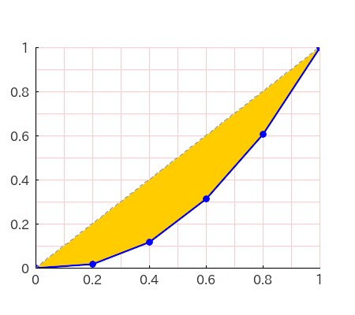
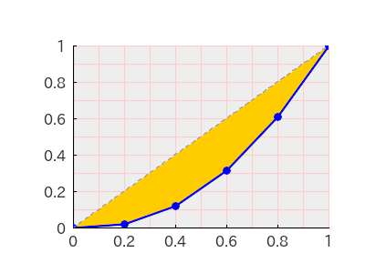
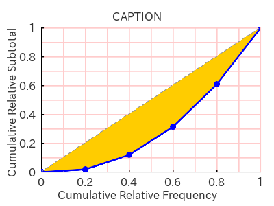
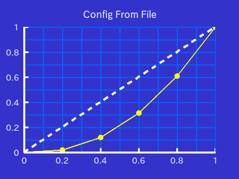

# PHP Lorenz Curve

A PHP Library to draw a Lorenz Curve.

## 1. Features

`PHP-LorenzCurve` draws a Lorenz Curve and also calculates the Gini's coefficient.


## 2. Contents

- [1. Features](#1-features)
- 2\. Contents
- [3. Requirements](#3-requirements)
- [4. Installation](#4-installation)
- [5. Usage](#5-usage)
    - [5.1. Basic Usage](#51-basic-usage)
    - [5.2. Adjusting the Appearance](#52-adjusting-the-appearance)
        - [5.2.1. Drawing Grid Lines](#521-drawing-grid-lines)
        - [5.2.2. Drawing an Upward Convex Curve](#522-drawing-an-upward-convex-curve)
        - [5.2.3. Setting the Image Size](#523-setting-the-image-size)
        - [5.2.4. Setting the Attributes of Plotarea](#524-setting-the-attributes-of-plotarea)
        - [5.2.5. Setting Caption and Labels](#525-setting-caption-and-labels)
        - [5.2.6. Setting Attributes with Array](#526-setting-attributes-with-array)
        - [5.2.7. Setting Attributes with Neon File](#527-setting-attributes-with-neon-file)
        - [5.2.8. Customisable Attributes](#528-customisable-attributes)
    - [5.3. Gini's Coefficient](#53-ginis-coefficient)
- [6. Examples](#6-examples)
- [7. LICENSE](#7-license)

## 3. Requirements

- PHP 8.1 or later
- Imagick PHP Extention
- Composer

## 4. Installation

```bash
composer require macocci7-lorenz-curve
```

## 5. Usage

### 5.1. Basic Usage

To draw a Lorenz Curve, create an instance of `LorenzCurve` class at first.

```php
<?php

require_once __DIR__ . '/../vendor/autoload.php';

use Macocci7\PhpLorenzCurve\LorenzCurve;

$lc = new LorenzCurve();
```

Next, set the data, the class range and save the image into a file.

```php
$lc
    ->setData([1, 5, 10, 15, 20])
    ->setClassRange(5)
    ->create('img/BasicUsage.png');
```

This results in the image below.


### 5.2. Adjusting the Appearance

#### 5.2.1. Drawing Grid Lines

You can draw grid lines with `grid()` method specifying the width and the color.

> Note: Specifying `null` as a color code results in transparent.

```php
$lc
    ->setData([1, 5, 10, 15, 20])
    ->setClassRange(5)
    ->grid(1, '#ffcccc')    // width: 1 pix, color: '#ffcccc'
    ->create('img/DrawGrid.png');
```

This results in the image below.


#### 5.2.2. Drawing an Upward Convex Curve

You can create an upward convex Lorenz Curve by sorting the list of the classes in decending order with `reverseClasses()` method.

```php
$lc
    ->setData([1, 5, 10, 15, 20])
    ->setClassRange(5)
    ->reverseClasses()
    ->grid(1, '#ffcccc')
    ->create('img/UpwardConvexCurve.png');
```

This results in the image below.


#### 5.2.3. Setting the Image Size

`PHP-LorenzCurve` generates images with a width of `400` pixels and a height of `300` pixels by default.

You can change the image size with `resize()` method.

- format: `resize(int $width, int $height)`

```php
$lc
    ->setData([1, 5, 10, 15, 20])
    ->setClassRange(5)
    ->grid(1, '#ffcccc')
    ->resize(450, 400)
    ->create('img/ResizeImage.png');
```

This code results in as below:



#### 5.2.4. Setting the Attributes of Plotarea

By default, `PHP-LorenzCurve` sets the Attributes of `Plotarea`:
- `offsetX`: 10% of the image width
- `offsetY`: 10% of the image height
- `width`: 80% of the image width
- `height`: 70% of the image height
- `backgroundColor`: `null` (transparent)

You can change them with `plotarea()` method.

- format:
    ```php
    plotarea(
        array $offset = [], // [int $width, int $height]
        int $width = 0,
        int $height = 0,
        string|null $backgroundColor = null,
    )
    ```

Sample code:

```php
$lc
    ->setData([1, 5, 10, 15, 20])
    ->setClassRange(5)
    ->grid(1, '#ffcccc')
    ->plotarea(
        offset: [80, 50],
        width: 280,
        height: 200,
        backgroundColor: '#eeeeee',
    )
    ->create('img/SetPlotareaAttrs.png');
```

This code results in as below:



#### 5.2.5. Setting Caption and Labels

You can set the `Caption` and `Labels` with `caption()`, `labelX()` and `labelY()` methods.

- Format:

    ```php
    caption(
        string $caption,
        int $offsetX = 0,
        int $offsetY = 0,
    )
    ```

    ```php
    labelX(
        string $label,
        int $offsetX = 0,
        int $offsetY = 0,
    )
    ```

    ```php
    labelY(
        string $label,
        int $offsetX = 0,
        int $offsetY = 0,
    )
    ```

Sample code:

```php
$lc
    ->setData([1, 5, 10, 15, 20])
    ->setClassRange(5)
    ->grid(1, '#ffcccc')
    ->plotarea(offset: [60, 40])
    ->caption('CAPTION')
    ->labelX('Cumulative Relative Frequency', offsetX: 0, offsetY: 10)
    ->labelY('Cumulative Relative Subtotal')
    ->create('img/CaptionLabels.png');
```

This code results in as below:



#### 5.2.6. Setting Attributes with Array

You can set attributes with the `config()` method passing array as an argument.

```php
$lc
    ->setData([1, 5, 10, 15, 20])
    ->setClassRange(5)
    ->config([
        'canvasBackgroundColor' => '#3333cc',
        'showGrid' => true,
        'gridWidth' => 1,
        'gridColor' => '#0066ff',
        'axisWidth' => 3,
        'axisColor' => '#ffffff',
        'scaleWidth' => 2,
        'scaleLength' => 6,
        'scaleColor' => '#ffffff',
        'scaleFontSize' => 14,
        'scaleFontColor' => '#ffffff',
        'lorenzCurveWidth' => 1,
        'lorenzCurveColor' => '#ffff00',
        'lorenzCurveBackgroundColor' => null, // transparent
        'completeEqualityLineWidth' => 3,
        'completeEqualityLineColor' => '#ffffff',
        'completeEqualityLineDash' => [8, 8],
        'fontColor' => '#ffffff',
        'caption' => 'Config From Array',
    ])
    ->create('img/ConfigFromArray.png');
```

This code results in as below:


See more: [Customizable Attributes](#528-customisable-attributes)

#### 5.2.7. Setting Attributes with Neon File

You can set attributes with `config()` method passing the neon file path as an argument.

First, create a Neon File.

```neon
canvasBackgroundColor: '#3333cc'
showGrid: true
gridWidth: 1
gridColor: '#0066ff'
axisWidth: 3
axisColor: '#ffffff'
scaleWidth: 2
scaleLength: 6
scaleColor: '#ffffff'
scaleFontSize: 14
scaleFontColor: '#ffffff'
lorenzCurveWidth: 1
lorenzCurveColor: '#ffff00'
lorenzCurveBackgroundColor:
completeEqualityLineWidth: 3
completeEqualityLineColor: '#ffffff'
completeEqualityLineDash: [8, 8]
fontColor: '#ffffff'
caption: 'Config From File'
```

Second, specify the path of the neon file as an argument of the `config()` method.

```php
$lc
    ->setData([1, 5, 10, 15, 20])
    ->setClassRange(5)
    ->config('ConfigFromFile.neon')
    ->create('img/ConfigFromFile.png');
```

This code results in as below:



See more: [Customizable Attributes](#528-customisable-attributes)

#### 5.2.8. Customisable Attributes

|attribute|type|default|example|description|
|:---|:---|:---:|:---:|:---|
|canvasSize['width']|int|400|450|image width|
|canvasSize['height']|int|300|400|image height|
|canvasBackgroundColor|string|'#ffffff'|'#0000ff'|background color of the image|
|plotarea['offset']|int[]|10% of the image size|[40, 50]|offset of the plotarea|
|plotarea['width']|int|80% of the image size|500|plotarea width|
|plotarea['height']|int|70% of the image size|400|plotarea height|
|plotarea['backgroundColor']|string|`null`|'#cccccc'|background color of  the plotarea|
|showGrid|bool|`false`|`true`|whether to show grid lines|
|gridWidth|int|1|2|grid line width|
|gridColor|string|'#cccccc'|'#0099ff'|grid line color|
|axisWidth|int|2|3|axis width|
|axisColor|string|'#000000'|'#ffffff'|axis color|
|scaleWidth|int|1|2|scale width|
|scaleLength|int|3|6|scale length|
|scaleColor|string|'#000000'|'#ffffff'|scale color|
|scaleFontSize|int|16|14|scale font size|
|scaleFontPath|string|'fonts/ipaexg.ttf'|'fonts/myfont.ttf'|scale font path|
|scaleFontColor|string|'#000000'|'#ffffff'|scale font color|
|lorenzCurveWidth|int|2|1|Lorenz Curve width|
|lorenzCurveColor|string|'#0000ff'|'#ffff00'|Lorenz Curve Color|
|lorenzCurveBackgroundColor|string|'#ffcc00'|`null`|Lorenz Curve background color|
|completeEqualityLineWidth|int|1|2|complete equality line width|
|completeEqualityLineColor|string|'#999999'|'#ffffff'|complete equality line color|
|completeEqualityLineDash|int[]|[4, 4]|[8, 8]|complete equality line dash pattern (solid and blank)|
|fontPath|string|'fonts/ipaexg.ttf'|'fonts/myfont.ttf'|font path|
|fontSize|int|16|14|font size|
|fontColor|string|'#333333'|'#ffffff'|font color|
|labelX|string|''|'Cumulative Relative Frequency'|x label|
|labelXOffsetX|int|0|-10|x-offset of x label|
|labelXOffsetY|int|0|10|y-offset of x label|
|labelY|string|''|'Cumulative Relative Subtotal'|y label|
|labelYOffsetX|int|0|-10|x-offset of y label|
|labelYOffsetY|int|0|-10|y-offset of y label|
|caption|string|''|'CAPTION'|caption|
|captionOffsetX|int|0|10|x-offset of caption|
|captionOffsetY|int|0|-10|y-offset of caption|

### 5.3. Gini's Coefficient

You can get the Gini's Coefficient with `getGinisCoefficient()` method without generating an image.

```php
var_dump(
    $lc
    ->setData([1, 5, 10, 15, 20])
    ->setClassRange(5)
    ->getGinisCoefficient()
);
```

This results in as below.

```bash
double(0.37647058823529)
```

## 6. Examples

- [BasicUsage.php](examples/BasicUsage.php) >> results in:

    

- [DrawGrid.php](examples/DrawGrid.php) >> results in:

    

- [UpwardConvexCurve.php](examples/UpwardConvexCurve.php) >> results in:

    

- [ResizeImage.php](examples/ResizeImage.php) >> results in:

    

- [SetPlotareaAttrs.php](examples/SetPlotareaAttrs.php) >> results in:

    

- [CaptionLabels.php](examples/CaptionLabels.php) >> results in:

    

- [ConfigFromArray.php](examples/ConfigFromArray.php) >> results in:

    

- [ConfigFromFile.php](examples/ConfigFromFile.php) with [ConfigFromFile.neon](examples/ConfigFromFile.neon) >> results in:

    

- [GinisCoefficient.php](examples/GinisCoefficient.php) >> results in:

    ```bash
    double(0.37647058823529)
    ```

- [GinisCoefficient0.php](examples/GinisCoefficient0.php) >> results in:

    

    ▼Gini's Coefficient:

    ```bash
    double(0)
    ```

- [GinisCoefficientAlmost1.php](examples/GinisCoefficientAlmost1.php) >> results in:

    

    ▼Gini's Coefficient:

    ```bash
    double(0.99800399201597)
    ```

- [GinisCoefficient1.php](examples/GinisCoefficient1.php) >> results in:

    

    ▼Gini's Coefficient:

    ```bash
    double(1)
    ```

## 7. LICENSE

[MIT](LICENSE)

***

*Copyright 2024 macocci7*
