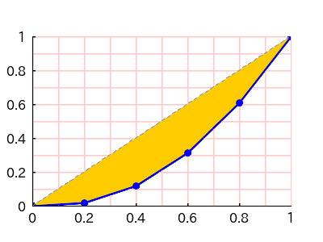
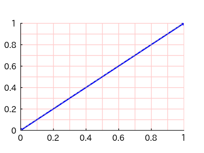

# PHP Lorenz Curve

A PHP Library to draw a Lorenz Curve.

## 1. Features

`PHP-LorenzCurve` draws a Lorenz Curve and also calculates the Gini's coefficient.


## 2. Contents

- [1. Features](#1-features)
- 2\. Contents
- [3. Requirements](#3-requirements)
- [4. Installation](#4-installation)
- [5. Usage](#5-usage)
- [6. Examples](#6-examples)
- [7. LICENSE](#7-license)

## 3. Requirements

- PHP 8.1 or later
- Imagick PHP Extention
- Composer

## 4. Installation

```bash
composer require macocci7-lorenz-curve
```

## 5. Usage

### 5.1. Basic Usage

To draw a Lorenz Curve, create an instance of `LorenzCurve` class at first.

```php
<?php

require_once __DIR__ . '/../vendor/autoload.php';

use Macocci7\PhpLorenzCurve\LorenzCurve;

$lc = new LorenzCurve();
```

Next, set the data, the class range and save the image into a file.

```php
$lc
    ->setData([1, 5, 10, 15, 20])
    ->setClassRange(5)
    ->create('img/BasicUsage.png');
```

This results in the image below.


### 5.2. Adjusting the Appearance

#### 5.2.1. Drawing Grid Lines

You can draw grid lines with `grid()` method specifying the width and the color.

> Note: Specifying `null` as a color code results in transparent.

```php
$lc
    ->setData([1, 5, 10, 15, 20])
    ->setClassRange(5)
    ->grid(1, '#ffcccc')    // width: 1 pix, color: '#ffcccc'
    ->create('img/DrawGrid.png');
```

This results in the image below.



#### 5.2.2. Drawing an Upward Convex Curve

You can create an upward convex Lorenz Curve by sorting the list of the classes in decending order with `reverseClasses()` method.

```php
$lc
    ->setData([1, 5, 10, 15, 20])
    ->setClassRange(5)
    ->reverseClasses()
    ->grid(1, '#ffcccc')
    ->create('img/UpwardConvexCurve.png');
```

This results in the image below.


#### 5.2.3. Setting the Image Size

`PHP-LorenzCurve` generates images with a width of `400` pixels and a height of `300` pixels by default.

You can change the image size with `resize()` method.

- format: `resize(int $width, int $height)`

```php
$lc
    ->setData([1, 5, 10, 15, 20])
    ->setClassRange(5)
    ->grid(1, '#ffcccc')
    ->resize(450, 400)
    ->create('img/ResizeImage.png');
```

This code results in as below:


#### 5.2.4. Setting the Attributes of Plotarea

By default, `PHP-LorenzCurve` sets the Attributes of `Plotarea`:
- `offsetX`: 10% of the image width
- `offsetY`: 10% of the image height
- `width`: 80% of the image width
- `height`: 70% of the image height
- `backgroundColor`: `null` (transparent)

You can change them with `plotarea()` method.

- format:
    ```php
    plotarea(
        array $offset = [], // [int $width, int $height]
        int $width = 0,
        int $height = 0,
        string|null $backgroundColor = null,
    )
    ```

Sample code:

```php
$lc
    ->setData([1, 5, 10, 15, 20])
    ->setClassRange(5)
    ->grid(1, '#ffcccc')
    ->plotarea(
        offset: [80, 50],
        width: 280,
        height: 200,
        backgroundColor: '#eeeeee',
    )
    ->create('img/SetPlotareaAttrs.png');
```

This code results in as below:


#### 5.2.5. Setting Caption and Labels

You can set the `Caption` and `Labels` with `caption()`, `labelX()` and `labelY()` methods.

- Format:

    ```php
    caption(
        string $caption,
        int $offsetX = 0,
        int $offsetY = 0,
    )
    ```

    ```php
    labelX(
        string $label,
        int $offsetX = 0,
        int $offsetY = 0,
    )
    ```

    ```php
    labelY(
        string $label,
        int $offsetX = 0,
        int $offsetY = 0,
    )
    ```

Sample code:

```php
$lc
    ->setData([1, 5, 10, 15, 20])
    ->setClassRange(5)
    ->grid(1, '#ffcccc')
    ->plotarea(offset: [60, 40])
    ->caption('CAPTION')
    ->labelX('Cumulative Relative Frequency', offsetX: 0, offsetY: 10)
    ->labelY('Cumulative Relative Subtotal')
    ->create('img/CaptionLabels.png');
```

This code results in as below:


### 5.3. Gini's Coefficient

You can get the Gini's Coefficient with `getGinisCoefficient()` method without generating an image.

```php
var_dump(
    $lc
    ->setData([1, 5, 10, 15, 20])
    ->setClassRange(5)
    ->getGinisCoefficient()
);
```

This results in as below.

```bash
double(0.37647058823529)
```

## 6. Examples

- [BasicUsage.php](examples/BasicUsage.php) >> results in:

    

- [DrawGrid.php](examples/DrawGrid.php) >> results in:

    

- [UpwardConvexCurve.php](examples/UpwardConvexCurve.php) >> results in:

    

- [ResizeImage.php](examples/ResizeImage.php) >> results in:

    

- [SetPlotareaAttrs.php](examples/SetPlotareaAttrs.php) >> results in:

    

- [CaptionLabels.php](examples/CaptionLabels.php) >> results in:

    

- [GinisCoefficient.php](examples/GinisCoefficient.php) >> results in:

    ```bash
    double(0.37647058823529)
    ```

- [GinisCoefficient0.php](examples/GinisCoefficient0.php) >> results in:

    

    ▼Gini's Coefficient:

    ```bash
    double(0)
    ```

- [GinisCoefficientAlmost1.php](examples/GinisCoefficientAlmost1.php) >> results in:

    

    ▼Gini's Coefficient:

    ```bash
    double(0.99800399201597)
    ```

- [GinisCoefficient1.php](examples/GinisCoefficient1.php) >> results in:

    

    ▼Gini's Coefficient:

    ```bash
    double(1)
    ```

## 7. LICENSE

[MIT](LICENSE)

***

*Copyright 2024 macocci7*
